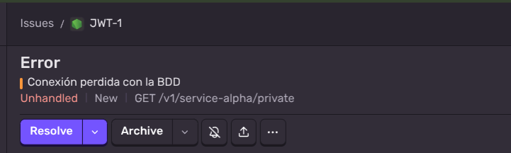
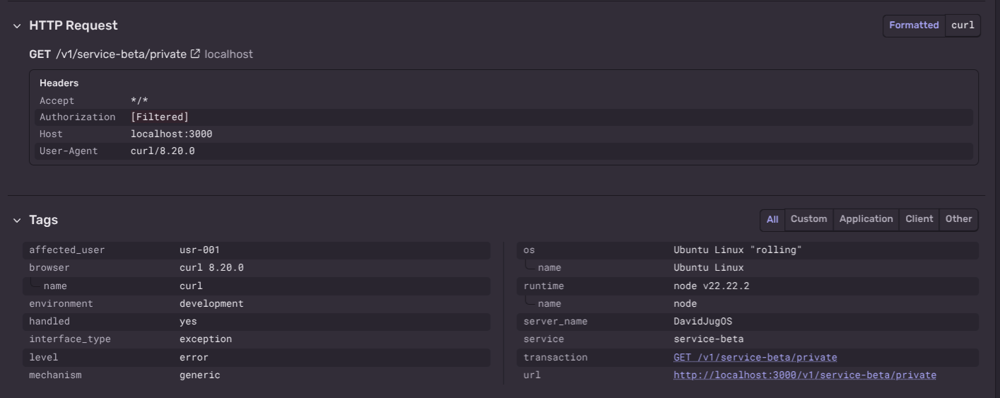

# Observabilidad con Sentry — Rama `feature/observabilidad-sentry`

**Repositorio:** https://github.com/davidcepeda1/jwt-pract/tree/feature/observabilidad-sentry

---

## 🏛️ DATOS INFORMATIVOS

| Campo | Detalle |
|---|---|
| **Institución** | Universidad de las Fuerzas Armadas ESPE |
| **Departamento** | Ciencias de la Computación |
| **Carrera** | Ingeniería de Software |
| **Asignatura** | Aplicaciones Distribuidas |
| **Tipo de evaluación** | Práctica Deber |
| **Estudiante** | David Gustavo Cepeda Salguero |
| **Fecha** | Junio 2026 |

---

## 🎯 OBJETIVO

Instrumentar el backend JWT RS256 con **Sentry** para capturar, clasificar y enriquecer eventos de error operacional en tiempo real, diferenciando explícitamente los fallos lógicos de autenticación (que no deben generar alertas) de los fallos operacionales críticos de los microservicios (que sí deben reportarse a la nube).

---

## 🗂️ ARCHIVOS MODIFICADOS EN ESTA RAMA

```
feature/observabilidad-sentry
├── src/
│   └── instrument.js                  ← NUEVO: inicialización de Sentry
├── controllers/
│   └── resource.controller.js         ← MODIFICADO: fallos simulados + scoping
├── middlewares/
│   └── auth.middleware.js             ← MODIFICADO: errores JWT silenciados en Sentry
├── index.js                           ← MODIFICADO: setupExpressErrorHandler + handler JSON
├── .env.example                       ← MODIFICADO: variables SENTRY_DSN y SENTRY_ENVIRONMENT
└── package.json                       ← MODIFICADO: --import en script start
```

---

## ⚙️ CONFIGURACIÓN DE VARIABLES DE ENTORNO

Copia `.env.example` a `.env` y completa los valores de Sentry:

```ini
# Server
PORT=3000

# JWT — asymmetric RS256 keys
JWT_PRIVATE_KEY_PATH=./private.pem
JWT_PUBLIC_KEY_PATH=./public.pem

# Sentry — observability & error tracking
SENTRY_DSN=https://<tu-dsn>@oxxxxxxx.ingest.sentry.io/xxxxxxx
SENTRY_ENVIRONMENT=development
```

> El `SENTRY_DSN` se obtiene en `sentry.io → Settings → Projects → [proyecto] → Client Keys`.

---

## 🔧 INICIALIZACIÓN DE SENTRY (`src/instrument.js`)

```js
import * as Sentry from '@sentry/node';

Sentry.init({
    dsn: process.env.SENTRY_DSN,
    environment: process.env.SENTRY_ENVIRONMENT,
    tracesSampleRate: 1.0,
});
```

**Por qué `--import` y no un `import` estático:**
Con `"type": "module"`, todos los `import` estáticos son hoisted y evaluados en paralelo antes de que corra cualquier línea de código. El flag `--import` de Node garantiza que `instrument.js` se ejecuta **antes de que el grafo de módulos de `index.js` se resuelva**, lo que Sentry v8+ necesita para parchear Express vía OpenTelemetry.

```json
"start": "node --import ./src/instrument.js index.js"
```

---

## 🛡️ CRITERIO 2 — DIFERENCIACIÓN LÓGICO vs OPERACIONAL

### Errores lógicos de JWT → silenciados en Sentry

Los errores de autenticación son comportamiento **esperado y controlado**. Reportarlos a Sentry generaría ruido y falsas alertas.

```js
// middlewares/auth.middleware.js
try {
    req.user = JwtService.verifyToken(token);
    next();
} catch (err) {
    if (err instanceof jwt.TokenExpiredError) {
        return res.status(401).json({ error: 'Token expirado' });
        // NO se llama a Sentry.captureException — error lógico esperado
    }
    if (err instanceof jwt.JsonWebTokenError) {
        return res.status(403).json({ error: 'Token inválido' });
        // NO se llama a Sentry.captureException — error lógico esperado
    }
    // Solo errores operacionales inesperados llegan a Sentry
    Sentry.captureException(err);
    return res.status(500).json({ error: 'Error interno de autenticación' });
}
```

| Escenario | HTTP | Reportado a Sentry |
|---|---|---|
| Header `Authorization` ausente | 401 | No |
| Token expirado (`exp` superado) | 401 | No |
| Firma inválida / algoritmo degradado | 403 | No |
| Error operacional en el middleware | 500 | **Si** |

---

## 🚨 CRITERIO 3 — TRACKING AUTOMÁTICO: Service Alpha

El controlador de Service Alpha lanza un error sin capturarlo. Express lo propaga a `Sentry.setupExpressErrorHandler(app)`, que lo intercepta y lo envía automáticamente a la nube antes de pasar al handler JSON global.

```js
// controllers/resource.controller.js
static getAlphaPrivateData(req, res) {
    throw new Error('Conexión perdida con la BDD');
    // Express 5 captura el throw síncrono y lo pasa a la cadena de error handlers
}
```

```js
// index.js — orden obligatorio al final del archivo
Sentry.setupExpressErrorHandler(app);   // 1. Sentry reporta a la nube

app.use((err, req, res, next) => {      // 2. Handler JSON devuelve respuesta controlada
    res.status(500).json({ error: 'Error interno del servidor' });
});
```

> El handler de error requiere exactamente **4 parámetros** `(err, req, res, next)` para que Express lo reconozca como error handler y no como middleware normal.

---

## 🔬 CRITERIO 4 — TRACKING MANUAL ENRIQUECIDO: Service Beta

Service Beta usa `Sentry.withScope` para capturar el error manualmente con **tags indexables** y **contexto extra**, visibles en el dashboard para diagnóstico preciso.

```js
// controllers/resource.controller.js
static getBetaPrivateData(req, res) {
    const userId = req.user.sub;

    try {
        throw new Error('Timeout al consultar el servicio de inventario');
    } catch (err) {
        Sentry.withScope((scope) => {
            // Tags: aparecen como filtros en el dashboard de Sentry
            scope.setTag('service', 'service-beta');
            scope.setTag('affected_user', userId);

            // Extra: visible en el panel de detalle del evento
            scope.setExtra('transfer_payload', {
                endpoint: 'GET /v1/service-beta/private',
                timestamp: new Date().toISOString(),
                // No se incluye: token, Authorization header, passwords
            });

            scope.setLevel('error');
            Sentry.captureException(err);
        });

        return res.status(500).json({ error: 'Error interno en Service Beta' });
    }
}
```

### Tags enviados a Sentry

| Tag | Valor ejemplo | Propósito |
|---|---|---|
| `service` | `service-beta` | Filtrar errores por microservicio |
| `affected_user` | `usr-001` | Identificar qué usuario experimentó el fallo |

### Contexto extra enviado a Sentry

| Campo | Valor ejemplo | Propósito |
|---|---|---|
| `endpoint` | `GET /v1/service-beta/private` | Ruta exacta que falló |
| `timestamp` | `2026-06-18T...` | Marca temporal del fallo |

> **Datos deliberadamente excluidos:** token JWT, header `Authorization`, credenciales. Cumple con el principio de mínima exposición de datos sensibles en herramientas de terceros.

---

## 📸 BITÁCORA DE EVIDENCIAS — DASHBOARD SENTRY

### Captura 1 — Error operacional de Service Alpha (tracking automático)



---

### Captura 2 — Tags y contexto personalizado de Service Beta



---

## 🛠️ INSTRUCCIONES DE DESPLIEGUE

```bash
# 1. Clonar y posicionarse en la rama
git clone https://github.com/davidcepeda1/jwt-pract.git
cd jwt-pract
git checkout feature/observabilidad-sentry

# 2. Instalar dependencias
npm install

# 3. Generar par de llaves RSA-2048
chmod +x keypair.sh && ./keypair.sh

# 4. Configurar entorno
cp .env.example .env
# Editar .env y completar SENTRY_DSN con el valor de tu proyecto en sentry.io

# 5. Iniciar servidor
npm start
```

### Disparar los eventos hacia Sentry

```bash
# Obtener token
curl -X POST http://localhost:3000/auth/token \
  -H "Content-Type: application/json" \
  -d '{"username":"admin","password":"admin123"}'

# Copiar access_token y usarlo en:

# Error automático — Service Alpha
curl http://localhost:3000/v1/service-alpha/private \
  -H "Authorization: Bearer <token>"

# Error con scope enriquecido — Service Beta
curl http://localhost:3000/v1/service-beta/private \
  -H "Authorization: Bearer <token>"
```

Verificar en `sentry.io → Issues` que ambos eventos aparecen con sus respectivos tags y contexto.

---

*Universidad de las Fuerzas Armadas ESPE — Práctica Deber — Junio 2026*
